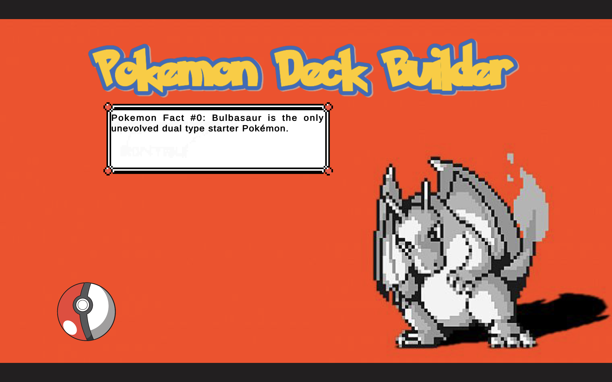
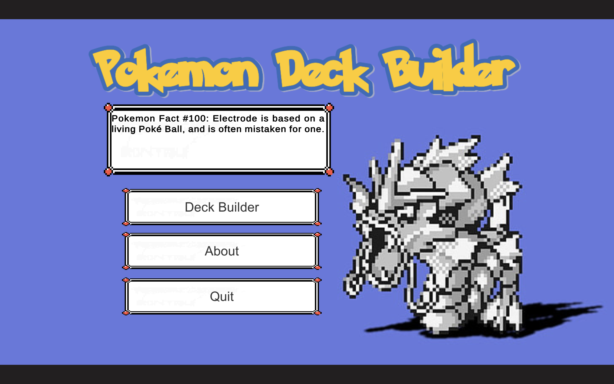
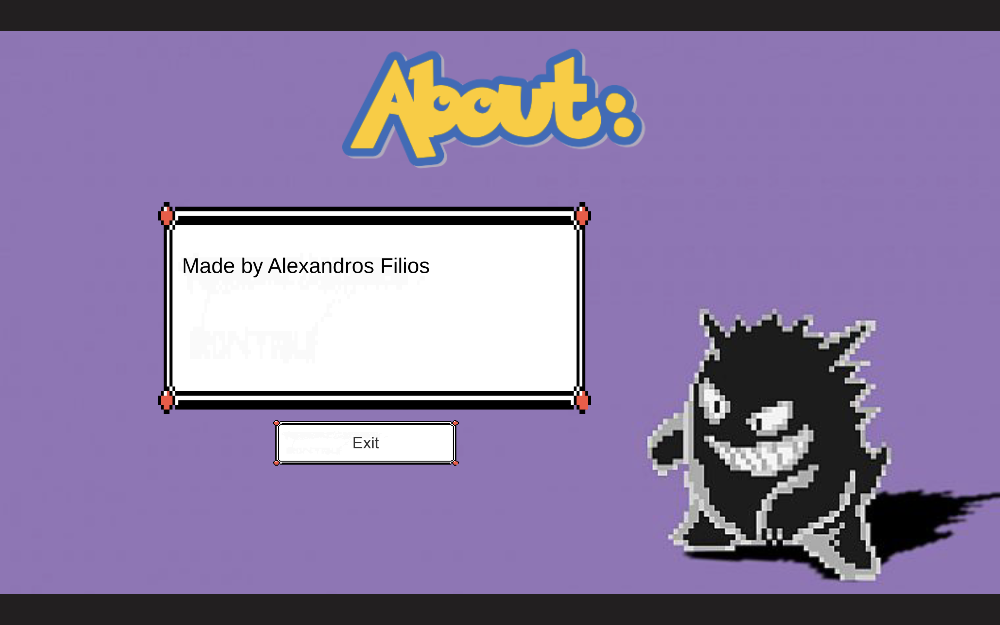
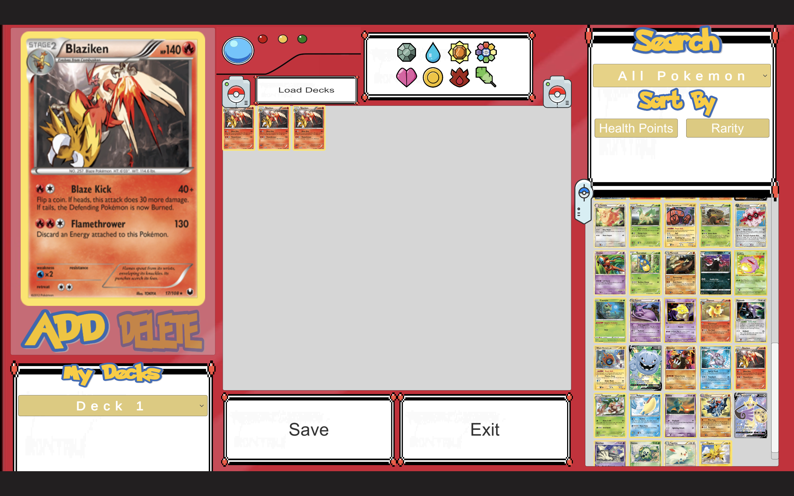

# PokemonTcgDeckBuilder

For this mini project, I created a mobile card deck builder. The app is fully runnable on Android and Windows.

The card builder is based on the popular Pokemon franchise and data is retrieved from the publicly available API  https://pokemontcg.io/.

The game has the following screens:
Loading: Use for any initialisation needed (e.g. pre-cache some card info)
Home: two choices, Deck builder and About that lead to the respective screens
Deck builder: The actual deck building
About: Yeap, here is my name
Additional capabilities for decks are:
The player is able to top build at least 3 decks
There are atleast 50 card to select from
The player can order by type, HP and rarity

Used the latest Unity (2020).
Deck persistence: The decks should be saved and retrieved from local storage 

### I DO NOT OWN ANYTHING RELATED TO POKEMON AND ALL RIGHTS BELONG TO The Pokémon Company ###

